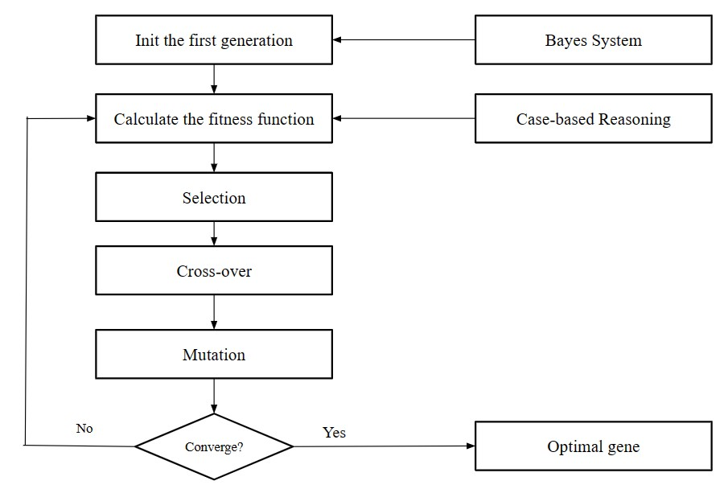

# Diagnosis of nutritional diseases through unhealthy habits and symptoms of the patient
The knowledge-based system helps diagnose nutritional diseases by analyzing unhealthy habits and symptoms. It leverages genetic algorithms, probability and case-based reasoning to achieve this.

